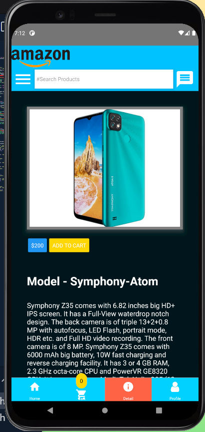
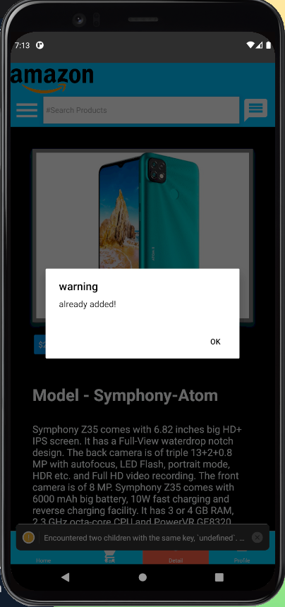
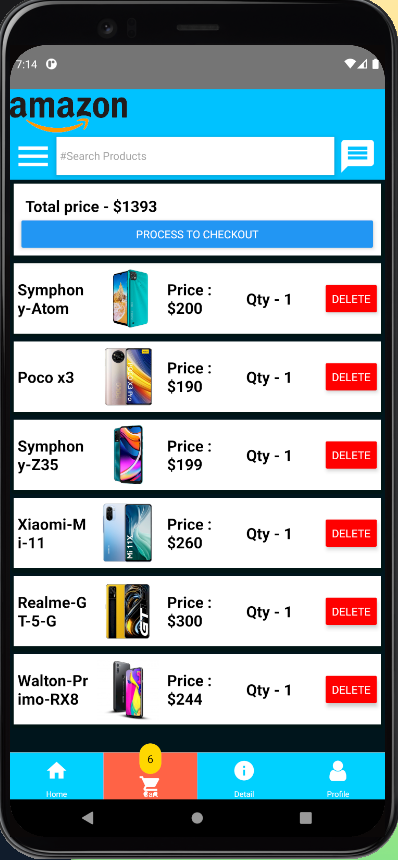
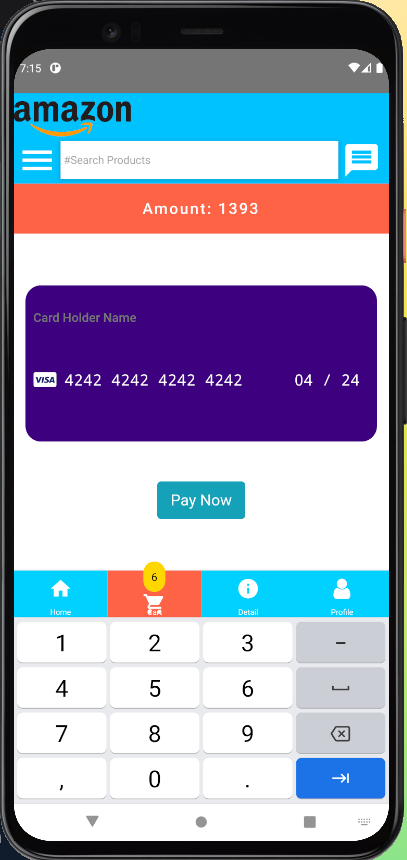
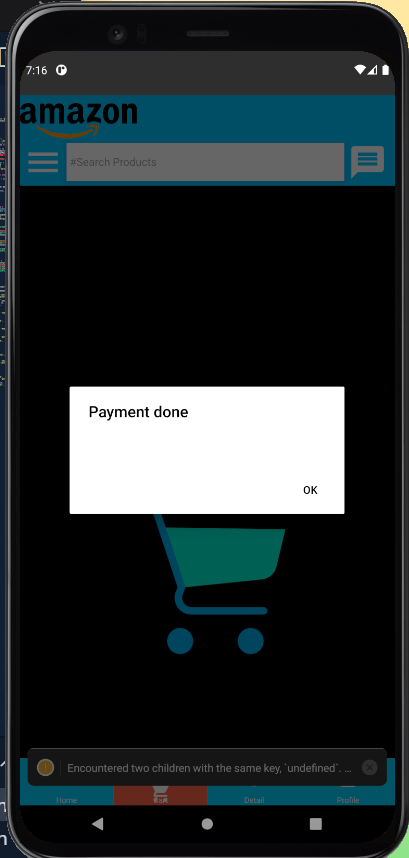
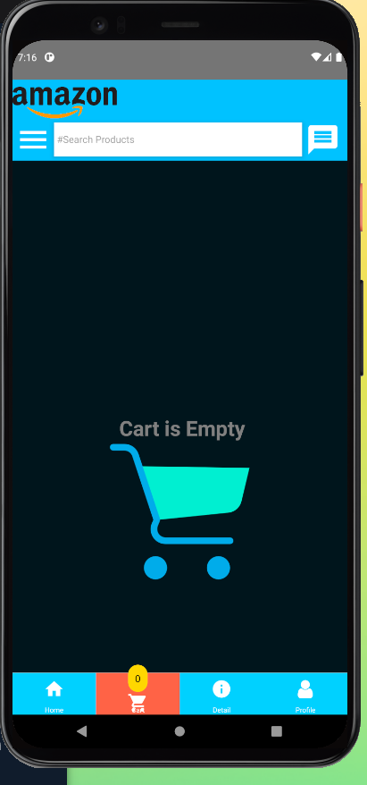
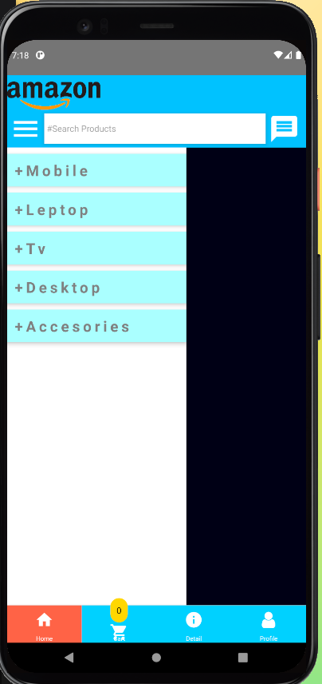

 
 

 

 

 
 
project Name : electronic Shop App
Author : Piyas Talukder

===========================

- [Github Link](https://github.com/piyas1234/electronicProductShop)
 

About project:
 
- this project is about ride place 

More information:
- [my website ](http://piyass.com)
- [facebook](https://web.facebook.com/piyastalukderr/)

