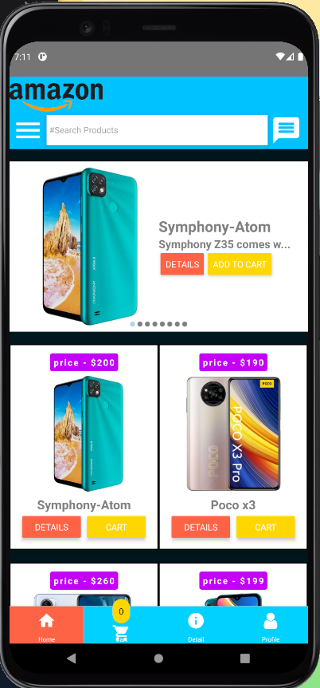

 
 

 

 

 
 
project Name : electronic Shop App
Author : Piyas Talukder

===========================

- [Live Site](https://go-riders-67527.web.app/)
- [Github Link](https://github.com/Porgramming-Hero-web-course/react-auth-piyas1234)
 

About project:
 
- this project is about ride place 

More information:
- [my website ](http://piyass.com)
- [facebook](https://web.facebook.com/piyastalukderr/)

